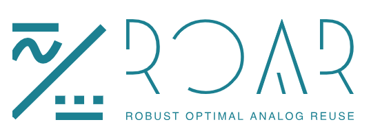

# ROAR Installation Instructions

## Requirements

- **Shell**: csh/tcsh (C Shell)
- **Make** build tool
<!-- - **Python 3** with pip -->
## Installation Steps

### 0. Ensure you are running csh/tcsh

This software requires the C Shell (csh) or tcsh. Verify your shell or switch to csh:

```csh
echo $SHELL
# If not running csh, switch to it:
csh
```

### 1. Download and Extract

Download and extract the ROAR software to the directory where you would like to install it:

```csh
tar -xzf roar.tar.gz -C /path/to/install/location
cd /path/to/install/location/roar
```

### 2. Build and Install

In the top-level `roar` directory, run Make to build and install the software:

```csh
make
```

This will install all required dependencies and create the `roar_env.csh` environment configuration file.

### 3. Set Up Environment

Before running the software, source the environment configuration file to set the required environment variables:

```csh
source roar_env.csh
```

**Note**: You will need to run this command each time you open a new terminal session, or add it to your `.cshrc` file for automatic loading:

```csh
echo "source /path/to/roar/roar_env.csh" >> ~/.cshrc
```

### 4. Run ROAR

Once the environment is set up, run the ROAR executable:

```csh
$ROAR_HOME/bin/roar
```

## Troubleshooting

### Environment Variables Not Set

If you receive errors about missing environment variables, ensure you have sourced the environment file:

```csh
source roar_env.csh
```

### Permission Denied

If you encounter permission issues with the executable:

```csh
chmod +x $ROAR_HOME/bin/roar
```
<!--
### Python Dependencies

If you need to manually install Python dependencies, they are listed in `roar/requirements.txt`:

```csh
pip install -r roar/requirements.txt
```
-->
## Quick Start Summary

```csh
# 1. Extract and navigate to roar directory
cd roar

# 2. Build
make

# 3. Set environment
source roar_env.csh

# 4. Run
$ROAR_HOME/bin/roar
```

## Usage

### Operating Modes

ROAR operates in two primary modes:

- **Design Eqs Mode**: Work with design equations and circuit parameters
- **Device Params Mode**: Configure and adjust device-specific parameters

Toggle between modes using the interface controls or keyboard shortcuts.

### Hot Keys

#### Plot Controls

| Key | Action |
|-----|--------|
| `x` | Toggle X-axis log scale |
| `y` | Toggle Y-axis log scale |
| `l` | Toggle log scale (both axes) |
| `v` | Add/toggle vertical marker |
| `h` | Add/toggle horizontal marker |

#### General

| Key | Action |
|-----|--------|
| `Ctrl+S` | Save current state |
| `Ctrl+O` | Open/load saved state |
| `Ctrl+Z` | Undo last action |
| `Ctrl+Y` | Redo action |
| `Ctrl+Q` | Quit ROAR |

### Saving and Loading States

**To save your current session:**
- Use `Ctrl+S` or File → Save State
- States are saved to `$ROAR_HOME/states/` by default

**To load a previously saved state:**
- Use `Ctrl+O` or File → Load State
- Navigate to your saved `.roar` state file

### Tips

- Save states frequently when working on complex designs
- Use descriptive filenames for saved states (e.g., `amplifier_v2.roar`)
- Switch to Device Params mode to fine-tune component values after initial design


### Known Issues

- 3-D Plotting functionality is currently limited and buggy; use 2-D plots for best results.
